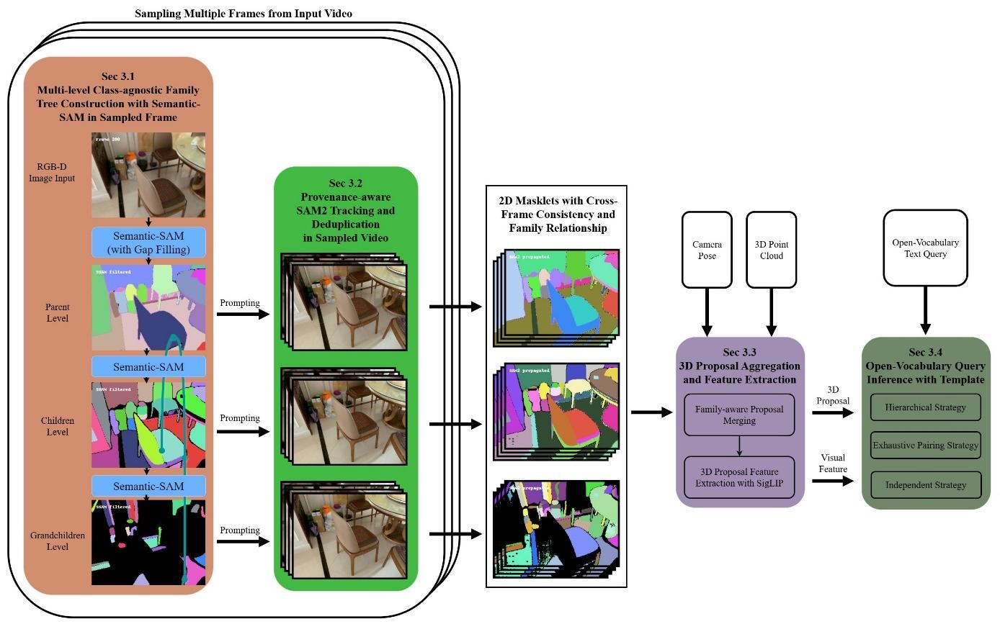
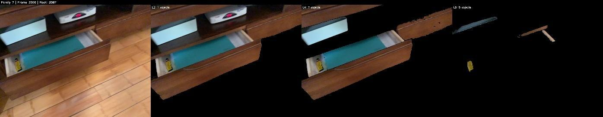
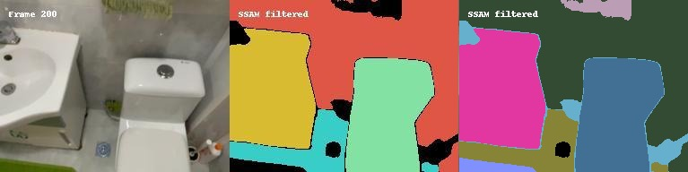
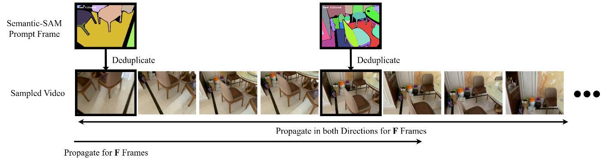
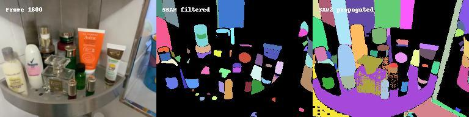
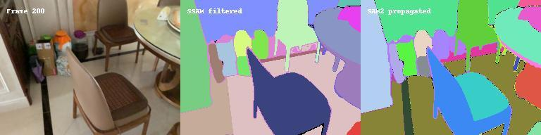

# FamilyPart: Training-free Open-vocabulary 3D Hierarchical Part Instance Segmentation via a Multi-level Family Tree

**Hsiang-Yu (Rich) Kung** · Advisor: Prof. Min Sun · Vision Science Lab, National Tsing Hua University · 2025

[**Report (PDF)**](report_B611.pdf) · [**Method**](#method-overview) · [**Results**](#experimental-results) · [**Failure Analysis**](#key-failure-modes)



## TL;DR

- **Goal:** find object *parts* in 3D scenes from free-text queries (e.g. "the handle of the drawer") without training any model.
- **Idea:** segment each RGB-D frame at three granularities with Semantic-SAM, link the masks into a parent → child → grandchild "family tree", track them across frames with SAM2, then lift them to 3D and match against text with SigLIP / CLIP.
- **Result:** the pipeline runs end-to-end on MultiScan, but reaches 1.0 mAP vs. 7.9 for the Search3D baseline.
- **Why it falls short:** IoU-only deduplication during SAM2 tracking lets masks of different granularities suppress each other, which breaks the family tree. See [Key Failure Modes](#key-failure-modes) for the diagnosis and proposed fixes.

---

## Overview

FamilyPart is a **training-free** research system for open-vocabulary 3D part-level instance segmentation. It constructs a family-like hierarchical structure by progressively segmenting images at multiple levels of granularity and aggregates 2D masklets into 3D proposals with cross-frame consistency enforced by class-agnostic mask supervision between deep learning models.

**Important Note**: This is an experimental research system. While it demonstrates the potential of training-free approaches using only posed RGB-D image sequences and 3D point clouds, the current mean average precision is not fully satisfactory compared to existing methods. We identify key failure modes and propose several directions for improvement.

---

## Research Motivation

Traditional 3D instance segmentation approaches operate at a single granularity level, missing the hierarchical nature of real-world scenes. In more complex scenarios, it is crucial to identify specific parts of objects. However, conventional 3D part-level instance segmentation pipelines are often constrained to a closed set of objects or parts, causing them to lose functionality outside of their training datasets.

**Key Challenge**:
1. Maintain consistent identity across frames at multiple granularity levels
2. Track which fine-level masks belong to which coarse-level objects
3. Handle deduplication when the same object is proposed at different levels
4. Preserve complete provenance from 2D masks → tracked objects → 3D proposals

**Our Approach**: Develop a **training-free pipeline** that:
- Constructs hierarchical, family-like structures based on different granularities
- Resolves ambiguity inherent in coarse-to-fine segmentation backbone models
- Does NOT require pre-segmented superpoint structures or 3D masks
- Depends solely on posed RGB-D image sequences and 3D point cloud structure

---

## Method Overview

### Stage 1: Multi-level Class-agnostic Family Tree Construction with Semantic-SAM

**Solo Photo Method**:
1. Prompt Semantic-SAM at three levels (e.g., L2=coarse, L4=medium, L6=fine)
2. For each L2 instance, conduct logical AND operation between original image and mask, padding black pixels as background → "solo photo"
3. Use solo photos as input and prompt Semantic-SAM at L4 to segment children
4. Output binary masks of children are ANDed with parents, ensuring children masks are always inside parents
5. Discard masks identical to parents or whose area is below threshold
6. Apply same procedure for L6 instances
7. Construct entire family tree and assign unique mask IDs via lookup table


*A family of instances in one frame. Left to right: original frame, one L2 instance, its seven L4 children, and five L6 grandchildren.*

**Gap Filling**:
- Extract connected pixel regions not covered by any highest-level mask
- Record as independent mask if area exceeds threshold
- Only applied at highest level to avoid missing objects


*Before and after gap filling. The rightmost image has gap filling applied.*

### Stage 2: Provenance-aware SAM2 Tracking and Deduplication

**Window-Based Method**:
- Sampling strategy with propagation stride of 50 (retain one frame every 50 frames)
- For each Semantic-SAM prompt frame, construct subsequence of length 2F+1 (F=30)
- Run SAM2 propagation within each overlapping window
- SAM2 maintains internal memory across windows


*Window-based tracking at a single level. Each Semantic-SAM prompt frame is deduplicated against existing tracks, then propagated F frames in both directions.*


*One frame: Semantic-SAM segments (middle) and the result after SAM2 tracking (right) at a single level.*

**Deduplication and Virtual Children**:
- Use Semantic-SAM masks as prompts for SAM2 video propagation
- Compare SAM2-tracked masks with Semantic-SAM masks using IoU
- If IoU > threshold, consider object already tracked
- **Virtual children mechanism**: Rejected Semantic-SAM candidates preserved at provenance level
  - System uses mask ID to determine which existing SAM2 object to merge into
  - Updates lookup table with virtual child relationships
  - O(1) time traceability to parent object
  - Ensures semantic relationships not lost due to deduplication

### Stage 3: 3D Proposal Aggregation and Feature Extraction

**Family-aware Proposal Merging**:
- Back-project 2D masklets into 3D space using camera intrinsic/extrinsic matrices
- Aggregate per-frame 3D masks by taking spatial union
- Apply minimum volume threshold to filter small proposals
- Merge overlapping proposals using IoU threshold of 0.5:
  - Top-level objects: merge and reassign child nodes to same parent
  - Lower-level nodes: merge restricted to siblings within same family tree

**3D Proposal Feature Extraction**:
- Use LAION-CLIP (768-dim) or SigLIP (1152-dim) encoders
- Multi-scale cropping (3 scales) by expanding bounding box outward
- L₂ normalization followed by averaging
- Temporal Gaussian weighting + bounding-box area weighting:
  - `wₖ = exp(-(k-c/σ)²) × √Aₖ`
  - `c = (K-1)/2`, `σ = K/4`
- Template-based text encoding: "a {part} of {object} in a room"

### Stage 4: Open-Vocabulary Query Inference

Three retrieval strategies are designed:

1. **Hierarchical Strategy** (Top-down family-tree guided):
   - Retrieve top-K₁ L2 candidates with highest similarity to object query
   - Collect L4 children if similarity exceeds threshold
   - Search descendants (L4/L6) for top-K₂ part candidates
   - Apply Cross-path NMS (only part proposals as NMS masks)
   - Sensitive to quality of highest-level proposals

2. **Exhaustive Pairing Strategy** (Enumerate all combinations):
   - Consider six (object, part) level combinations: (L2,L2), (L2,L4), (L2,L6), (L4,L4), (L4,L6), (L6,L6)
   - Retain top-K pairs with highest similarity scores
   - Validate pairings in 3D space, discard non-overlapping
   - Apply Cross-path NMS
   - Higher pairing complexity but bypasses family tree limitations

3. **Independent Strategy** (Decouple object and part retrieval):
   - Match highest level (L2) against object query
   - Match lower levels (L4/L6) against part query
   - Compute geometric score based on IoU and size ratio
   - Combine with retrieval scores via weighted average
   - **Best performance** in experiments

---

## Experimental Results

### Dataset and Metrics
- **Dataset**: MultiScan with Search3D benchmark
  - 155 object + 15 part categories
  - 47 (object, part) pairs
  - 41 scenes (4 without ground-truth annotations)
- **Metric**: Mean Average Precision (mAP) under Search3D protocol

### Performance Summary

| Configuration | mAP | AP50 | AP25 |
|--------------|-----|------|------|
| **FamilyPart (Best: L1/3/5, SigLIP, Independent)** | **1.0** | **3.4** | **14.7** |
| Search3D [1] (Baseline) | 7.9 | 14.5 | 31.5 |

### Strategy Comparison (Averaged over 7 Experiments)

| Strategy | mAP | AP50 | AP25 |
|----------|-----|------|------|
| Independent | 0.84 | 2.90 | 8.59 |
| Exhaustive | 0.51 | 1.54 | 8.39 |
| Hierarchical | 0.25 | 0.75 | 7.01 |

### Level Comparison (LAION-CLIP, min. area=500)

| Level | Independent<br/>mAP/AP50/AP25 | Hierarchical<br/>mAP/AP50/AP25 | Exhaustive<br/>mAP/AP50/AP25 |
|-------|------|------------|------------|
| L1/L3/L5 | 1.2 / 3.7 / 8.0 | 0.0 / 0.1 / 4.3 | 1.1 / 3.2 / 11.0 |
| L2/L4/L6 | 0.3 / 1.6 / 6.8 | 0.9 / 2.3 / 10.7 | 0.0 / 0.2 / 7.8 |

### Feature Extractor Comparison (L1/3/5, min. area=100)

| Model | Independent<br/>mAP/AP50/AP25 | Hierarchical<br/>mAP/AP50/AP25 | Exhaustive<br/>mAP/AP50/AP25 |
|-------|------|------------|------------|
| LAION-CLIP | 1.2 / 3.7 / 11.4 | 0.0 / 0.1 / 3.8 | 0.5 / 1.4 / 8.3 |
| SigLIP | 1.1 / 3.1 / 11.8 | 0.1 / 0.4 / 6.6 | 0.9 / 2.7 / 9.7 |

**Key Findings**:
- Fewer than half of 41 scenes achieve non-zero mAP
- Hierarchical strategy performs particularly poorly (only 1 scene with non-zero mAP)
- Independent strategy achieves best AP
- SigLIP generally outperforms LAION-CLIP
- Performance still notably behind Search3D baseline

---

## Key Failure Modes

### 1. Deduplication Issue (Primary Problem)

**Problem**: IoU-only criterion destroys hierarchical structure
- When SAM2 tracks across viewpoints, same object may be represented by masks of different granularities
- Masks at different scales suppress each other using IoU-only comparison
- Intended hierarchical structure is effectively destroyed
- Part masks occasionally larger than corresponding object masks


*Granularity drift after SAM2 tracking (see the chair): the tracked mask no longer matches the granularity of the Semantic-SAM prompt.*

**Impact**:
- Hierarchical strategy fails almost completely
- Assumption that children are always contained inside parents no longer holds
- L2/L4/L6 combination performs worse than L1/L3/L5

### 2. Aggressive Filtering

Due to hardware constraints:
- Increased minimum area threshold to save memory
- Many fine-grained part-level masks discarded
- Further degrades part-level performance

### 3. Feature Alignment

- SigLIP and LAION-CLIP alone insufficient for tight alignment
- Even with ground-truth 3D masks, not every label attains similarity > 0.8
- Considerable variation across labels

---

## Future Directions

Based on current findings, we identify promising directions for improvement:

1. **Size-aware Deduplication Module**
   - Distinguish whether two masks stand in containment relationship or are truly identical
   - Explicitly account for relative mask size
   - Preserve children when appropriate, rather than relying solely on IoU

2. **Scale-adaptive Filtering**
   - Different granularity levels should not share single, global minimum-area threshold
   - Prevent fine-grained part-level masks from being discarded

3. **Enhanced Scoring Mechanisms**
   - More sophisticated weighting or feature fusion strategies
   - Improve feature alignment between 3D proposals and text queries

---

## Getting Started

### Prerequisites
- Two conda environments (see [`envs/`](envs/) for setup steps):
  - **Semantic-SAM**: Detectron2 0.6 + PyTorch 1.13 ([`envs/semantic-sam.yml`](envs/semantic-sam.yml))
  - **SAM2**: PyTorch 2.x ([`envs/sam2.yml`](envs/sam2.yml))
- MultiScan dataset (or custom RGB-D sequences with camera poses)
- **Semantic-SAM checkpoint**: `swinl_only_sam_many2many`
- **SAM2 checkpoint**: `sam2.1_hiera_large`

### Directory Layout

All paths in `configs/` and `scripts/` are relative to the repository root, so run commands from there. The expected layout is:

```
FamilyPart/
├── data/
│   ├── multiscan/          # MultiScan scenes (a symlink is fine)
│   └── search3d_gt/        # Search3D ground truth (scripts/setup_search3d_gt.sh)
├── third_party/
│   ├── Semantic-SAM/       # with ckpts/swinl_only_sam_many2many.pth
│   └── Grounded-SAM-2/     # with checkpoints/sam2.1_hiera_large.pt
├── models/                 # optional local copy of siglip-so400m-patch14-384
└── outputs/                # experiment outputs (created automatically)
```

Model locations can also be overridden with environment variables: `MY3DIS_SEMANTIC_SAM_ROOT`, `MY3DIS_SEMANTIC_SAM_CKPT`, `MY3DIS_SAM2_ROOT`, `MY3DIS_SAM2_CFG`, `MY3DIS_SAM2_CKPT`, `MY3DIS_DATA_PATH`, `MY3DIS_DATASET_ROOT`, `MY3DIS_OUTPUT_ROOT` (see `src/my3dis/pipeline_defaults.py` and `src/my3dis/workflow/executor.py`). Relative paths are resolved against the directory you launch from, before any stage changes into the Semantic-SAM / SAM2 repos.

### Known Gaps

- Stage 3 (`src/my3dis/aggregation/aggregation_pipeline.py`) and several evaluation scripts import helper modules (`utils_load`, `utils_new`) from `3DprojToSiglip/`, a lab-internal codebase written by a mentor at the Vision Science Lab. It is not included in this repository.
- Evaluation uses the official Search3D script (`eval_semantic_instance_parts_OV.py`), which must be obtained from the Search3D release.

### Quick Start

**Stage 1-2: Segmentation + Tracking (Single Scene)**:
```bash
./run_experiment.sh \
  --levels 2,4,6 \
  --frames 1200:1600:20 \
  --ssam-freq 2 \
  --sam2-max-propagate 30
```

**Stage 1-2: Multi-Scene Batch Processing**:
```bash
PYTHONPATH=src python -m my3dis.run_workflow \
  --config configs/multiscan/base.yaml
```

**Stage 3-4: Aggregation + Inference (After Tracking)**:
```bash
python scripts/run_full_pipeline.py \
  --config configs/inference/full_pipeline.yaml \
  --exp-dir outputs/experiments/<your_experiment_name>
```

### Configuration Example

```yaml
experiment:
  dataset_root: /path/to/multiscan
  scenes: [scene_00065_00, scene_00093_01]
  levels: [1, 3, 5]  # or [2, 4, 6]
  frames: "1200:1600:20"

stages:
  ssam:
    enabled: true
    ssam_freq: 4  # Sample every 4th frame (T/200 frames)
    area_threshold: 100  # or 500 depending on memory

  tracker:
    enabled: true
    iou_threshold: 0.6
    downscale_ratio: 0.3
    propagation_stride: 50  # T/50 frames
    window_size: 30  # 2F+1 frames

  aggregation:
    enabled: true
    iou_threshold: 0.5
    min_visible_area_fraction: 0.0005

  inference:
    enabled: true
    feature_extractor: "siglip"  # or "laion-clip"
    scoring_strategy: "independent"  # best performance
    scale_semantic_score: 200  # 300 for laion-clip
```

---

## Project Structure

```
FamilyPart/
├── src/my3dis/           # Core package
│   ├── workflow/         # Multi-scene orchestration
│   ├── tracking/         # SAM2 tracking + provenance
│   ├── aggregation/      # 3D proposal generation
│   ├── inference/        # Feature extraction + retrieval
│   ├── mask/             # Mask encoding/geometry utilities
│   └── utils/            # Shared utilities
│
├── configs/              # YAML configuration templates
│   ├── multiscan/        # Dataset-specific configs
│   └── inference/        # Retrieval strategy configs
│
├── scripts/              # Automation and analysis tools
│   ├── run_full_pipeline.py
│   └── benchmark_*.py
│
├── run_experiment.sh     # Single-scene orchestrator
└── README.md             # This file
```

---

## Output Format

### Per-Scene Outputs
```
outputs/<experiment_name>/<scene_id>/
├── level_2/ (or level_1/)
│   ├── raw/              # Raw Semantic-SAM candidates
│   ├── filtered/         # Filtered candidates
│   └── tracking/         # SAM2 tracked objects
├── level_4/ (or level_3/)
├── level_6/ (or level_5/)
├── relations/
│   ├── provenance_tree_L2.json  # Per-level lineage
│   ├── provenance_tree_L4.json
│   ├── provenance_tree_L6.json
│   └── family_tree.json         # Unified hierarchy
├── proposals_L*.npz      # 3D aggregated proposals
├── features_L*.npz       # Feature embeddings
└── workflow_summary.json # Timing/resource statistics
```

### Inference Outputs
```
outputs/inference/<experiment_name>/
├── predictions.json      # Search3D format
├── object_counts.json    # Per-scene statistics
└── inference_summary.json
```

---

## Implementation Details

- **Semantic-SAM**: `swinl_only_sam_many2many` checkpoint
- **SAM2**: `sam2.1_hiera_large` checkpoint
- **Feature Extractors**:
  - LAION-CLIP ViT-L/14: `laion/CLIP-ViT-L-14-laion2B-s32B-b82K`
  - SigLIP: `google/siglip-so400m-patch14-384`
- **Sampling**:
  - Semantic-SAM: Every 4th frame (~T/200 frames)
  - SAM2: Every 50th frame (~T/50 frames)
- **Thresholds**:
  - IoU for deduplication: 0.6
  - IoU for merging: 0.5
  - Downscale ratio: 0.3
  - Minimum area: 100-500 (depends on memory)
  - Minimum visible area fraction: 0.0005

---

## Design Philosophy

### Training-Free Approach
This work demonstrates the potential of developing 3D part segmentation pipelines using only:
- Posed RGB-D image sequences
- 3D point clouds
- Pre-trained foundation models (Semantic-SAM, SAM2, SigLIP/CLIP)

No training or fine-tuning required for novel environments.

### Provenance Tracking
Rather than post-hoc spatial containment, FamilyPart tracks provenance from mask generation:
- Explicit parent-child relationships across levels
- Virtual children for complete lineage preservation
- O(1) parent lookup through unified mapping

### Honest Reporting
We openly acknowledge that current results are not fully satisfactory. The deduplication issues significantly impact performance. This transparency helps future research identify and address these limitations.

---

## Python Package Name

The repository is published as **FamilyPart**, but the Python package remains `my3dis` for backward compatibility:

```python
# All imports use my3dis
from my3dis.workflow import SceneWorkflow
from my3dis.tracking import ProvenanceTracker
```

When running scripts:
```bash
export PYTHONPATH=src
python -m my3dis.run_workflow --config config.yaml
```

---

## Acknowledgments

FamilyPart builds upon:
- **Semantic-SAM** [5] for multi-level candidate generation
- **SAM2** [6] for temporal mask tracking
- **SigLIP** [7] and **LAION-CLIP** [8] for open-vocabulary feature extraction
- **MultiScan** [3] dataset and **Search3D** [1] benchmark

**Mentors at Vision Science Lab, NTHU**:
- Yen Hong-Xuan, Ou Yeh, Chen Chia-Min and Wang Yan-Qing 

---

## License

Released under the [MIT License](LICENSE).

---

## References

[1] A. Takmaz et al., "Search3D: Hierarchical Open-Vocabulary 3D Segmentation," IEEE RA-L, vol. 10, no. 3, pp. 2558-2565, 2025.

[2] A. Takmaz et al., "OpenMask3D: Open-Vocabulary 3D Instance Segmentation," NeurIPS, vol. 36, 2023.

[3] Y. Mao et al., "MultiScan: Scalable RGBD Scanning for 3D Environments with Articulated Objects," NeurIPS, vol. 35, 2022.

[4] H. Yin et al., "Semantic Consistent Language Gaussian Splatting for Point-Level Open-vocabulary Querying," arXiv:2503.21767, 2025.

[5] F. Li et al., "Semantic-SAM: Segment and Recognize Anything at Any Granularity," ECCV, pp. 467-484, 2024.

[6] N. Ravi et al., "SAM 2: Segment Anything in Images and Videos," arXiv:2408.00714, 2024.

[7] X. Zhai et al., "Sigmoid Loss for Language Image Pre-Training," ICCV, pp. 11975-11986, 2023.

[8] LAION-AI, "LAION-CLIP: OpenCLIP Models Trained on the LAION-2B Dataset," Hugging Face / OpenCLIP, 2023-2024.
